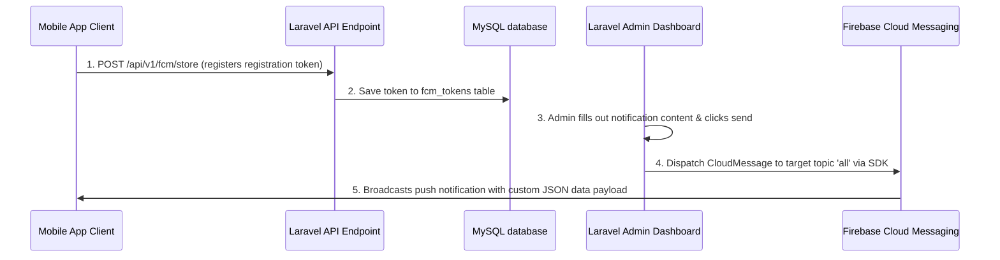

# 🚀 FCM Push Notification Integration Guide

This guide provides a comprehensive step-by-step documentation package to implement the **Firebase Cloud Messaging (FCM)** push notification system from this project into any other **Laravel 10 / 11 / 12** project.

---

## 📋 System Architecture Flow


---

## 🛠️ Step 1: Install Package Dependency

In your other Laravel project directory, install the official Firebase SDK wrapper via Composer:

```bash
composer require kreait/firebase-php
```

---

## 🗄️ Step 2: Database Migration & Model

### 2.1 Create the migration file
Generate a migration for the FCM tokens repository:
```bash
php artisan make:migration create_fcm_tokens_table
```

Inside the generated migration file, use the following schema:
```php
<?php

use Illuminate\Database\Migrations\Migration;
use Illuminate\Database\Schema\Blueprint;
use Illuminate\Support\Facades\Schema;

return new class extends Migration
{
    public function up(): void
    {
        Schema::create('fcm_tokens', function (Blueprint $table) {
            $table->id();
            // Connects token to user (nullable for guest devices)
            $table->foreignId('user_id')->nullable()->constrained()->onDelete('cascade');
            $table->string('token')->unique();
            $table->string('platform')->nullable(); // e.g. android, ios, web
            $table->timestamps();
        });
    }

    public function down(): void
    {
        Schema::dropIfExists('fcm_tokens');
    }
};
```

Run the migration:
```bash
php artisan migrate
```

### 2.2 Define the Eloquent Model
Create the model `App\Models\FcmToken.php`:
```php
<?php

namespace App\Models;

use Illuminate\Database\Eloquent\Model;
use Illuminate\Database\Eloquent\Relations\BelongsTo;

class FcmToken extends Model
{
    protected $table = 'fcm_tokens';

    protected $fillable = [
        'user_id',
        'token',
        'platform'
    ];

    /**
     * Get the user that owns the token.
     */
    public function user(): BelongsTo
    {
        return $this->belongsTo(User::class);
    }
}
```

Optional: In your `App\Models\User.php` class, define the inverse relationship:
```php
public function fcmTokens()
{
    return $this->hasMany(FcmToken::class);
}
```

---

## 📡 Step 3: API & Web Routes

Add the endpoints to receive client registration tokens and render/handle notifications.

### 3.1 API Routes (`routes/api.php`)
```php
use App\Http\Controllers\Api\FcmController;

Route::prefix('v1')->group(function () {
    // FCM Tokens upload endpoint (throttled to protect database)
    Route::post('/fcm/store', [FcmController::class, 'store'])->middleware('throttle:60,1');
});
```

### 3.2 Web Routes (`routes/web.php`)
```php
use App\Http\Controllers\AdminNotificationController;

Route::prefix('admin')->middleware(['auth', 'admin'])->name('admin.')->group(function () {
    // Render send dashboard
    Route::get('notifications/create', [AdminNotificationController::class, 'create'])->name('notifications.create');
    // Upload service credentials
    Route::post('notifications/upload-credentials', [AdminNotificationController::class, 'uploadCredentials'])->name('notifications.upload_credentials');
    // Send Notification action
    Route::post('notifications/send', [AdminNotificationController::class, 'send'])->name('notifications.send');
});
```

---

## 🎮 Step 4: Add Controllers

### 4.1 Token Receiver Controller
Create `app/Http/Controllers/Api/FcmController.php` to handle registrations sent from mobile devices:

```php
<?php

namespace App\Http\Controllers\Api;

use App\Http\Controllers\Controller;
use App\Models\FcmToken;
use Illuminate\Http\Request;
use Illuminate\Support\Facades\Validator;

class FcmController extends Controller
{
    /**
     * Store or update an FCM token sent by mobile device client.
     */
    public function store(Request $request)
    {
        $validator = Validator::make($request->all(), [
            'token' => 'required|string|unique:fcm_tokens,token,' . ($request->id ?? 'NULL') . ',id',
            'platform' => 'nullable|string|in:android,ios,web',
        ]);

        if ($validator->fails()) {
            return response()->json([
                'success' => false,
                'message' => 'Validation error',
                'errors' => $validator->errors()
            ], 422);
        }

        $token = FcmToken::updateOrCreate(
            ['token' => $request->token],
            [
                // Supports auth:api or fallback to null (for guest sessions)
                'user_id' => auth()->check() ? auth()->id() : null,
                'platform' => $request->platform,
            ]
        );

        return response()->json([
            'success' => true,
            'message' => 'FCM Token saved successfully',
            'data' => $token
        ]);
    }
}
```

### 4.2 Admin Notification Controller
Create `app/Http/Controllers/AdminNotificationController.php` to process uploads and broadcast alerts:

```php
<?php

namespace App\Http\Controllers;

use App\Http\Controllers\Controller;
use Illuminate\Http\Request;
use Kreait\Firebase\Factory;
use Kreait\Firebase\Messaging\CloudMessage;
use Kreait\Firebase\Messaging\Notification;
use Illuminate\Support\Facades\Log;

class AdminNotificationController extends Controller
{
    /**
     * Location of the service credentials file.
     */
    protected function getCredentialsPath()
    {
        return storage_path('app/private/app/firebase_credentials.json');
    }

    /**
     * Show the notification creation form.
     */
    public function create(Request $request)
    {
        $hasCredentials = file_exists($this->getCredentialsPath());
        return view('admin.notifications.create', compact('hasCredentials'));
    }

    /**
     * Upload the Firebase Service Account credentials.
     */
    public function uploadCredentials(Request $request)
    {
        $request->validate([
            'firebase_credentials' => 'required|file|mimetypes:application/json,text/plain',
        ]);

        try {
            $dirPath = storage_path('app/private/app');
            if (!file_exists($dirPath)) {
                mkdir($dirPath, 0755, true);
            }

            // Move credentials file securely
            $request->file('firebase_credentials')->move($dirPath, 'firebase_credentials.json');
            
            return back()->with('success', 'Firebase credentials uploaded successfully! You can now send notifications.');
        } catch (\Throwable $e) {
            Log::error('Firebase Credentials Upload Error: ' . $e->getMessage());
            return back()->with('error', 'Failed to upload credentials: ' . $e->getMessage());
        }
    }

    /**
     * Send manual push notification to 'all' topic.
     */
    public function send(Request $request)
    {
        $request->validate([
            'title' => 'required|string|max:255',
            'body' => 'required|string',
            'image_url' => 'nullable|url',
        ]);

        try {
            $serviceAccountPath = $this->getCredentialsPath();

            if (!file_exists($serviceAccountPath)) {
                return back()->with('error', 'Firebase Service Account credentials missing. Please upload the configuration file.');
            }

            $factory = (new Factory)->withServiceAccount($serviceAccountPath);
            $messaging = $factory->createMessaging();

            $title = $request->input('title');
            $body = $request->input('body');
            $imageUrl = $request->input('image_url');

            // 1. Create standard notification presentation payload
            $notification = Notification::create($title, $body);
            if ($imageUrl) {
                $notification = $notification->withImageUrl($imageUrl);
            }

            // 2. Wrap payload with custom JSON parameters matching app router expectations
            $message = CloudMessage::withTarget('topic', 'all')
                ->withNotification($notification)
                ->withData([
                    'click_action' => 'FLUTTER_NOTIFICATION_CLICK',
                    'type' => 'general',
                    'title' => $title,
                    'body' => $body,
                    'image' => (string)$imageUrl
                ]);

            $messaging->send($message);

            return back()->with('success', 'Notification broadcast sent successfully to all users!');
        } catch (\Throwable $e) {
            Log::error('Firebase Send Manual Notification Error: ' . $e->getMessage());
            return back()->with('error', 'Failed to send notification: ' . $e->getMessage());
        }
    }
}
```

---

## 🎨 Step 5: Dashboard View UI File

Create the Blade template `resources/views/admin/notifications/create.blade.php`:

```html
@extends('admin.layout')

@section('title', 'Send Notifications')

@section('content')
<div class="container pt-4">
    <div class="d-flex justify-content-between align-items-center mb-4 border-bottom pb-2">
        <h2>Send Push Notifications</h2>
    </div>

    <div class="row">
        <div class="col-md-8 offset-md-2">
            @if (session('success'))
                <div class="alert alert-success alert-dismissible fade show" role="alert">
                    {{ session('success') }}
                    <button type="button" class="btn-close" data-bs-dismiss="alert" aria-label="Close"></button>
                </div>
            @endif

            @if (session('error'))
                <div class="alert alert-danger alert-dismissible fade show" role="alert">
                    {{ session('error') }}
                    <button type="button" class="btn-close" data-bs-dismiss="alert" aria-label="Close"></button>
                </div>
            @endif

            <!-- 1. Credentials File Missing Dashboard Warning -->
            @if(!$hasCredentials)
            <div class="card border-danger mb-4 shadow">
                <div class="card-header bg-danger text-white">
                    <h5 class="mb-0"><i class="fas fa-exclamation-triangle"></i> Firebase Credentials Missing</h5>
                </div>
                <div class="card-body text-dark">
                    <p>To send push notifications, you must upload your Firebase Service Account JSON config file (<code>firebase_credentials.json</code>).</p>
                    <p class="small text-muted">Retrieve this inside: <strong>Firebase Console > Project Settings > Service accounts > Generate new private key</strong>.</p>
                    
                    <form action="{{ route('admin.notifications.upload_credentials') }}" method="POST" enctype="multipart/form-data">
                        @csrf
                        <div class="mb-3">
                            <label for="firebase_credentials" class="form-label font-weight-bold">Upload credentials JSON file</label>
                            <input class="form-control" type="file" id="firebase_credentials" name="firebase_credentials" accept=".json" required>
                        </div>
                        <button type="submit" class="btn btn-danger">Upload Credentials</button>
                    </form>
                </div>
            </div>
            @else
            <!-- 2. Active Messaging Form -->
            <div class="card shadow">
                <div class="card-header d-flex justify-content-between align-items-center bg-primary text-white">
                    <h5 class="mb-0">Broadcast New Push Alert</h5>
                    <span class="badge bg-light text-primary"><i class="fas fa-check-circle"></i> Service Connected</span>
                </div>
                <div class="card-body">
                    <form action="{{ route('admin.notifications.send') }}" method="POST">
                        @csrf
                        
                        <div class="mb-3">
                            <label for="title" class="form-label font-weight-bold">Notification Title *</label>
                            <input type="text" class="form-control @error('title') is-invalid @enderror" id="title" name="title" value="{{ old('title') }}" required placeholder="e.g. Special Content Update!">
                            @error('title')
                                <div class="invalid-feedback">{{ $message }}</div>
                            @enderror
                        </div>
                        
                        <div class="mb-3">
                            <label for="body" class="form-label font-weight-bold">Notification Body text *</label>
                            <textarea class="form-control @error('body') is-invalid @enderror" id="body" name="body" rows="4" required placeholder="Describe details to motivate user clicks..."></textarea>
                            @error('body')
                                <div class="invalid-feedback">{{ $message }}</div>
                            @enderror
                        </div>
                        
                        <div class="mb-3">
                            <label for="image_url" class="form-label font-weight-bold">Image URL (Optional)</label>
                            <input type="url" class="form-control @error('image_url') is-invalid @enderror" id="image_url" name="image_url" value="{{ old('image_url') }}" placeholder="https://example.com/banner.jpg">
                            <div class="form-text small">Image will render directly inside push notifications banners on supported devices.</div>
                            @error('image_url')
                                <div class="invalid-feedback">{{ $message }}</div>
                            @enderror
                        </div>

                        <div class="alert alert-warning text-dark">
                            <i class="fas fa-info-circle"></i> sending this dispatches standard FCM messages to the topic <code>all</code> immediately.
                        </div>

                        <button type="submit" class="btn btn-primary btn-lg w-100">
                            <i class="fas fa-paper-plane"></i> Send Push Broadcast
                        </button>
                    </form>

                    <!-- Credentials Renewal Accordion -->
                    <div class="accordion mt-4" id="accordionCredentials">
                        <div class="accordion-item">
                            <h2 class="accordion-header" id="headingOne">
                                <button class="accordion-button collapsed py-2" type="button" data-bs-toggle="collapse" data-bs-target="#collapseOne" aria-expanded="false" aria-controls="collapseOne">
                                    Replace Credentials config
                                </button>
                            </h2>
                            <div id="collapseOne" class="accordion-collapse collapse" aria-labelledby="headingOne" data-bs-parent="#accordionCredentials">
                                <div class="accordion-body">
                                    <form action="{{ route('admin.notifications.upload_credentials') }}" method="POST" enctype="multipart/form-data">
                                        @csrf
                                        <div class="input-group">
                                            <input class="form-control" type="file" id="firebase_credentials_update" name="firebase_credentials" accept=".json" required>
                                            <button type="submit" class="btn btn-outline-danger">Update</button>
                                        </div>
                                    </form>
                                </div>
                            </div>
                        </div>
                    </div>
                </div>
            </div>
            @endif
        </div>
    </div>
</div>
@endsection
```

---

## ⏰ Step 6: Scheduled Cron Task Integration

To automate push suggestions via cron tasks, implement this Artisan Command inside your application.

### 6.1 Create the command
```bash
php artisan make:command SendWeeklyRecommendations
```

### 6.2 Set up execution logic
Open `app/Console/Commands/SendWeeklyRecommendations.php` and configure it as follows:

```php
<?php

namespace App\Console\Commands;

use Illuminate\Console\Command;
use Kreait\Firebase\Factory;
use Kreait\Firebase\Messaging\CloudMessage;
use Kreait\Firebase\Messaging\Notification;
use Illuminate\Support\Str;
use Illuminate\Support\Facades\Log;

class SendWeeklyRecommendations extends Command
{
    /**
     * Command Signature (Run using: php artisan app:send-recommendations)
     */
    protected $signature = 'app:send-recommendations';

    protected $description = 'Pushes highlighted content to all registered user devices via Firebase FCM';

    public function handle()
    {
        $this->info('Starting push broadcast scheduler task...');

        // 1. Resolve private service credentials key
        $serviceAccountPath = storage_path('app/private/app/firebase_credentials.json');
        if (!file_exists($serviceAccountPath)) {
            $this->error('FCM aborted: firebase_credentials.json not found inside storage folder.');
            Log::error('SendRecommendations Command: Firebase credentials file missing.');
            return 1;
        }

        // 2. Fetch target highlight content item from your database (example structure)
        // $item = Content::inRandomOrder()->first();
        // if (!$item) return 1;

        $title = "Recommended Highlight!";
        $body = "Check out our weekly popular picks. Tap to explore details instantly.";
        $imageUrl = "https://yourdomain.com/default-banner.jpg";

        // 3. Dispatch to Firebase Target Topic
        try {
            $factory = (new Factory)->withServiceAccount($serviceAccountPath);
            $messaging = $factory->createMessaging();

            $notification = Notification::create($title, $body);
            if ($imageUrl) {
                $notification = $notification->withImageUrl($imageUrl);
            }

            // Target 'all' topic. Client devices must subscribe to 'all' topic on setup.
            $message = CloudMessage::withTarget('topic', 'all')
                ->withNotification($notification)
                ->withData([
                    'click_action' => 'FLUTTER_NOTIFICATION_CLICK',
                    'type' => 'recommendation',
                    'image' => (string)$imageUrl,
                    'title' => (string)$title,
                    'body' => (string)$body
                ]);

            $messaging->send($message);
            
            $this->info('Scheduled recommendation notification sent successfully!');
            Log::info("SendRecommendations Command: Dispatched FCM topic push successfully.");
            return 0;

        } catch (\Throwable $e) {
            $this->error('FCM Broadcast Dispatch failed: ' . $e->getMessage());
            Log::error('SendRecommendations Command Exception: ' . $e->getMessage());
            return 1;
        }
    }
}
```

### 6.3 Scheduling in Laravel 11/12
Register your scheduler cron frequency inside `routes/console.php` (or `app/Console/Kernel.php` for Laravel 10 and below):

```php
use Illuminate\Support\Facades\Schedule;

// Runs the recommendations broadcast automatically every Friday morning at 9:00 AM
Schedule::command('app:send-recommendations')->fridays()->at('09:00');
```

---

## 🔧 Step 7: How to Download Firebase JSON Credentials

To connect your project backend to Firebase Messaging APIs, fetch the secret key file:

1.  Navigate to the [Firebase Console](https://console.firebase.google.com/).
2.  Click your project settings gear icon in the sidebar > **Project Settings**.
3.  Go to the **Service accounts** tab.
4.  Verify that **Firebase Admin SDK** is selected, and click **Generate new private key**.
5.  Save the downloaded `.json` file.
6.  Upload this file directly via your Laravel Admin Dashboard panel to configure the system instantly.

---

## 📱 Step 8: Client-Side Subscription Setup

In order to receive these push broadcasts, your mobile (or web) app must subscribe to the topic **`all`** after initializing the Firebase integration.

### Flutter (Dart Example)
```dart
import 'package:firebase_messaging/firebase_messaging.dart';

class NotificationService {
  final FirebaseMessaging _firebaseMessaging = FirebaseMessaging.instance;

  Future<void> initialize() async {
    // 1. Request OS permissions
    NotificationSettings settings = await _firebaseMessaging.requestPermission(
      alert: true,
      badge: true,
      sound: true,
    );

    if (settings.authorizationStatus == AuthorizationStatus.authorized) {
      // 2. Subscribe to general broadcast topic
      await _firebaseMessaging.subscribeToTopic('all');
      print('Device successfully subscribed to FCM "all" broadcast topic.');
    }
  }
}
```
